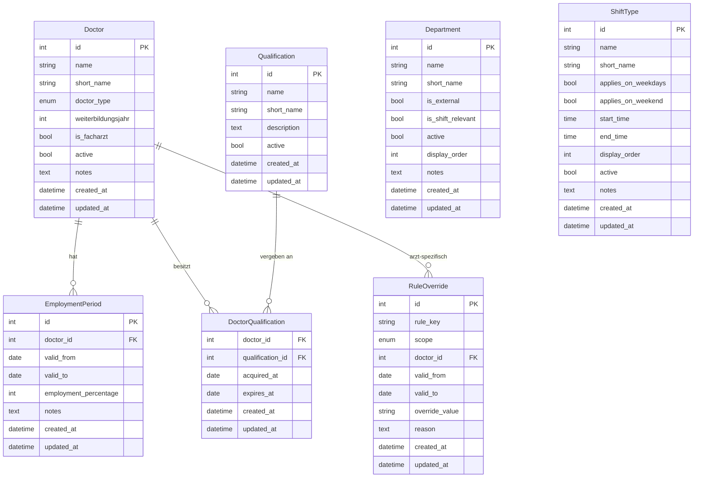

# Datenmodell – Stammdaten

Dieser Artikel beschreibt die Stammdaten-Entitäten des Dienstplaners,
implementiert in Meilenstein M1. Plan-Entitäten (Plan, Schicht, Zuweisung,
Abwesenheit, Wunsch) werden in M2 ergänzt.

## Entitäten-Übersicht

## Erläuterungen

### Warum `EmploymentPeriod` zeitabhängig ist

Der Beschäftigungsumfang eines Arztes (Vollzeit/Teilzeit-Prozentsatz) kann
sich im Laufe der Zeit ändern – z.B. nach Rückkehr aus Elternzeit oder bei
Wechsel von 50% auf 80%. Das Modell speichert daher nicht einen statischen
Wert am Arzt, sondern Perioden mit `valid_from`/`valid_to`.

`valid_to = NULL` bedeutet "unbefristet gültig" (aktueller Zeitraum).
Es ist Aufgabe des Service-Layers, den zum Planungsmonat passenden Zeitraum
zu ermitteln.

### Was `DoctorType.EXTERNAL` bedeutet

Externe Ärzte (z.B. Leihärzte, Honorarärzte) haben ein vereinfachtes Modell:
- Sie haben typischerweise **keine** `EmploymentPeriods` (das Modell erlaubt
  eine leere Liste).
- Planungs-Constraints aus dem Tarifvertrag TV-Ärzte/TdL gelten für sie
  nicht oder nur eingeschränkt.
- Sie können dennoch Dienste übernehmen und werden im Dienstplan aufgeführt.

### Warum `is_external` und `is_shift_relevant` getrennt sind

Ein `Department` kann eine externe Rotation sein (`is_external=True`), also
eine Stelle außerhalb der eigenen Klinik (z.B. Psychiatrie, Intensiv Innere).
Diese Bereiche brauchen keine eigene Dienstplanung (`is_shift_relevant=False`).

Die Felder sind dennoch unabhängig, weil theoretisch auch ein externer Bereich
geplante Dienste haben könnte. Beide Felder werden separat konfiguriert.

### Wie `RuleOverride` funktioniert (Ebenen A und B)

Override-Ebene A (global): `scope=GLOBAL`, `doctor_id=NULL`.
Gilt für alle Ärzte in einem Zeitraum. Beispiel: im August sind grundsätzlich
mehr Bereitschaftsdienste erlaubt.

Override-Ebene B (arzt-spezifisch): `scope=DOCTOR`, `doctor_id=<id>`.
Gilt nur für einen bestimmten Arzt. Beispiel: Dr. Müller darf in Q1 2024
maximal 4 Nachtdienste leisten statt der üblichen 6.

`valid_from`/`valid_to` begrenzen den Gültigkeitszeitraum eines Overrides.
`NULL` bedeutet "unbegrenzt" in die jeweilige Richtung.

`override_value` ist eine String-Repräsentation des neuen Wertes. Der
Service-Layer interpretiert den Typ anhand von `rule_key`.

Override-Ebene C (Einzel-Verstoß-Akzeptanz) ist plan-bezogen und wird
in Meilenstein M2/M5 ergänzt.

## Initiale Bereiche (21 Stück)

| Nr | Name | Kürzel | Extern | Dienst-relevant |
|----|------|--------|--------|-----------------|
| 1 | 511/LBEST | LBEST | Nein | Ja |
| 2 | 511 | 511 | Nein | Ja |
| 3 | ITS | ITS | Nein | Ja |
| 4 | SU-Stationsarzt | SU-SA | Nein | Ja |
| 5 | SU | SU | Nein | Ja |
| 6 | Duplex | Du | Nein | Ja |
| 7 | Poli | Poli | Nein | Ja |
| 8 | Poli/EMG | Poli/EMG | Nein | Ja |
| 9 | EMG | EMG | Nein | Ja |
| 10 | Springer | Spr | Nein | Ja |
| 11 | Parkinson Komplextherapie | ParkiKomp | Nein | Ja |
| 12 | Tagesklinik | TK | Nein | Ja |
| 13 | Neuromotorik-TK | NM-TK | Nein | Ja |
| 14 | Poli/Botox/THS | – | Nein | Ja |
| 15 | Poli/Botox | – | Nein | Ja |
| 16 | MS-Sprechstunde/Konsile | MS | Nein | Ja |
| 17 | Forschung | Fo | Nein | Ja |
| 18 | Curschmann Klinik | CK | Nein | Ja |
| 19 | Intensiv Innere | – | Ja | Nein |
| 20 | Psychiatrie | – | Ja | Nein |
| 21 | ZIP | – | Ja | Nein |

## Initiale Schichttypen

| Name | Kürzel | Werktag | Wochenende |
|------|--------|---------|------------|
| V-Dienst | V | Ja | Nein |
| Tagdienst | T | Nein | Ja |
| Nachtdienst | N | Ja | Ja |

Uhrzeiten (`start_time`, `end_time`) sind vorerst `NULL` und werden später
konfiguriert.

## Hinweis: Plan-Entitäten folgen in M2

Die Entitäten Plan, Schicht, Zuweisung, Abwesenheit und Wunsch werden
in Meilenstein M2 ergänzt. Das vorliegende Schema bildet die vollständige
Stammdaten-Grundlage.
