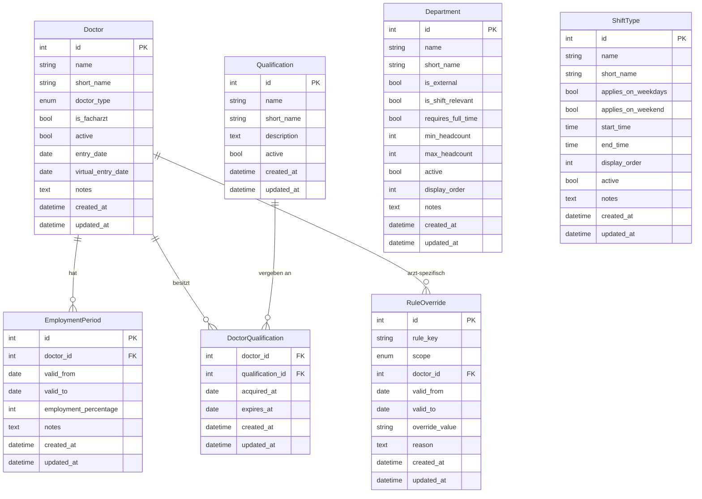

# Datenmodell – Stammdaten

Dieser Artikel beschreibt die Stammdaten-Entitäten des Dienstplaners,
implementiert in Meilenstein M1. Plan-Entitäten (Plan, Schicht, Zuweisung,
Abwesenheit, Wunsch) werden in M2 ergänzt.

## Entitäten-Übersicht

## Erläuterungen

### Warum `EmploymentPeriod` zeitabhängig ist

Der Beschäftigungsumfang eines Arztes (Vollzeit/Teilzeit-Prozentsatz) kann
sich im Laufe der Zeit ändern – z.B. nach Rückkehr aus Elternzeit oder bei
Wechsel von 50% auf 80%. Das Modell speichert daher nicht einen statischen
Wert am Arzt, sondern Perioden mit `valid_from`/`valid_to`.

`valid_to = NULL` bedeutet "unbefristet gültig" (aktueller Zeitraum).
Es ist Aufgabe des Service-Layers, den zum Planungsmonat passenden Zeitraum
zu ermitteln.

### Was `DoctorType.EXTERNAL` bedeutet

Externe Ärzte (z.B. Leihärzte, Honorarärzte) haben ein vereinfachtes Modell:
- Sie haben typischerweise **keine** `EmploymentPeriods` (das Modell erlaubt
  eine leere Liste).
- Planungs-Constraints aus dem Tarifvertrag TV-Ärzte/TdL gelten für sie
  nicht oder nur eingeschränkt.
- Sie können dennoch Dienste übernehmen und werden im Dienstplan aufgeführt.

### `entry_date` und `virtual_entry_date` am Arzt

`entry_date` ist das reale Eintrittsdatum des Arztes in die Klinik.

`virtual_entry_date` ist das für die Rotationspriorisierung maßgebliche
virtuelle Eintrittsdatum. Es ergibt sich aus dem realen Eintrittsdatum plus
Anrechnungszeiten (z.B. aus Voranstellungen). Da das virtuelle Datum auf
Anrechnungen basiert, kann es **vor** dem realen Eintrittsdatum liegen.

Beide Felder sind nullable. Für externe Ärzte werden sie typischerweise nicht
gepflegt. In der ersten Version werden beide Felder manuell gesetzt.
Eine automatische Berechnung aus konfigurierten Anrechnungszeiten folgt später.

### `weiterbildungsjahr` als computed property

`weiterbildungsjahr` wird **nicht** in der Datenbank gespeichert, sondern bei
jedem API-Aufruf berechnet. Berechnungsregel:

- Wenn `is_facharzt = True`: `weiterbildungsjahr = null`
- Wenn `entry_date = null`: `weiterbildungsjahr = null`
- Wenn `entry_date` in der Zukunft liegt: `weiterbildungsjahr = null`
- Sonst: `weiterbildungsjahr = floor((heute - entry_date).days / 365.25) + 1`

Beispiele (heute = 2026-05-07):
- `entry_date=2024-05-01` → ~2 Jahre → WBJ 3
- `entry_date=2026-05-07` → 0 Jahre → WBJ 1
- `entry_date=2025-12-31` → ~0.35 Jahre → WBJ 1

Das Feld erscheint in der OpenAPI-Spezifikation (via Pydantic `@computed_field`),
ist im Frontend read-only und wird nicht als Formularfeld angeboten.

### Warum `is_external` und `is_shift_relevant` getrennt sind

Ein `Department` kann eine externe Rotation sein (`is_external=True`), also
eine Stelle außerhalb der eigenen Klinik (z.B. Psychiatrie, Intensiv Innere).
Diese Bereiche brauchen keine eigene Dienstplanung (`is_shift_relevant=False`).

Die Felder sind dennoch unabhängig, weil theoretisch auch ein externer Bereich
geplante Dienste haben könnte. Beide Felder werden separat konfiguriert.

### `requires_full_time` an Bereichen

Manche Rotationen können ausschließlich von Vollzeit-Mitarbeitern (100%)
besetzt werden. Das Feld `requires_full_time` kennzeichnet diese Bereiche.

Aktuell betrifft das die Curschmann Klinik (CK). Weitere Bereiche können
im Laufe der Zeit hinzukommen.

Die Durchsetzung (keine Teilzeit-Zuweisung auf Vollzeit-Rotation) erfolgt
in Meilenstein M5 als Constraint im Solver. Das Feld ist reine Metadaten für
den Planungskontext.

### `min_headcount` und `max_headcount` an Bereichen (Sollbesetzung)

Die Felder `min_headcount` und `max_headcount` definieren die Sollbesetzung
eines Bereichs. Beide sind nullable:

- `min_headcount = null`: keine Mindestbesetzung definiert
- `max_headcount = null`: keine Obergrenze (unbegrenzt)
- `max_headcount = 0`: Bereich darf nicht besetzt sein (geschlossen)
- Alle Werte im Bereich `[min, max]` sind akzeptabel

Validierungsregeln: beide Felder >= 0; wenn beide gesetzt, dann min <= max.

Die Seeds setzen Initialwerte aus der Excel-Auswertung. Manuell gepflegte
Werte werden durch erneutes Seeden **nicht** überschrieben (Idempotenz).

Die Durchsetzung (Plan unterschreitet Mindestbesetzung) folgt in M5/M8.

### Wie `RuleOverride` funktioniert (Ebenen A und B)

Override-Ebene A (global): `scope=GLOBAL`, `doctor_id=NULL`.
Gilt für alle Ärzte in einem Zeitraum. Beispiel: im August sind grundsätzlich
mehr Bereitschaftsdienste erlaubt.

Override-Ebene B (arzt-spezifisch): `scope=DOCTOR`, `doctor_id=<id>`.
Gilt nur für einen bestimmten Arzt. Beispiel: Dr. Müller darf in Q1 2024
maximal 4 Nachtdienste leisten statt der üblichen 6.

`valid_from`/`valid_to` begrenzen den Gültigkeitszeitraum eines Overrides.
`NULL` bedeutet "unbegrenzt" in die jeweilige Richtung.

`override_value` ist eine String-Repräsentation des neuen Wertes. Der
Service-Layer interpretiert den Typ anhand von `rule_key`.

Override-Ebene C (Einzel-Verstoß-Akzeptanz) ist plan-bezogen und wird
in Meilenstein M2/M5 ergänzt.

## Initiale Bereiche (23 Stück)

| Nr | Name | Kürzel | Extern | Dienst-relevant | Vollzeit | Min | Max |
|----|------|--------|--------|-----------------|----------|-----|-----|
| 1 | 511/LBEST | LBEST | Nein | Ja | Nein | 1 | 1 |
| 2 | 511 | 511 | Nein | Ja | Nein | 2 | 3 |
| 3 | ITS | ITS | Nein | Ja | Nein | 2 | 3 |
| 4 | SU-Stationsarzt | SU-SA | Nein | Ja | Nein | 1 | 1 |
| 5 | SU | SU | Nein | Ja | Nein | 6 | 8 |
| 6 | Duplex | Du | Nein | Ja | Nein | 1 | 1 |
| 7 | Poli | Poli | Nein | Ja | Nein | 1 | 1 |
| 8 | Poli/EMG | Poli/EMG | Nein | Ja | Nein | 1 | 1 |
| 9 | EMG | EMG | Nein | Ja | Nein | 1 | 1 |
| 10 | Springer | Spr | Nein | Ja | Nein | 2 | 2 |
| 11 | Parkinson Komplextherapie | ParkiKomp | Nein | Ja | Nein | 1 | 1 |
| 12 | Tagesklinik | TK | Nein | Ja | Nein | 1 | 1 |
| 13 | Neuromotorik-TK | NM-TK | Nein | Ja | Nein | 1 | 1 |
| 14 | Poli/Botox/THS | – | Nein | Ja | Nein | 1 | 1 |
| 15 | Poli/Botox | – | Nein | Ja | Nein | 1 | 1 |
| 16 | MS-Sprechstunde/Konsile | MS | Nein | Ja | Nein | 1 | 1 |
| 17 | Forschung | Fo | Nein | Ja | Nein | 4 | 5 |
| 18 | Curschmann Klinik | CK | Nein | Ja | **Ja** | – | – |
| 19 | Intensiv Innere | – | Ja | Nein | Nein | 1 | 1 |
| 20 | Psychiatrie | – | Ja | Nein | Nein | 2 | 4 |
| 21 | ZIP | – | Ja | Nein | Nein | 0 | 1 |
| 22 | Intensiv (NCH) | – | Ja | Nein | Nein | 1 | 1 |
| 23 | Intensiv extern | – | Ja | Nein | Nein | 1 | 1 |

## Initiale Schichttypen

| Name | Kürzel | Werktag | Wochenende | Start | Ende |
|------|--------|---------|------------|-------|------|
| V-Dienst | V | Ja | Nein | – | – |
| Tagdienst | T | Nein | Ja | – | – |
| Nachtdienst | N | Ja | Ja | – | – |
| Tagdienst INA | T1 | Ja | Nein | 07:30 | 16:00 |

Uhrzeiten für V, T, N sind vorerst `NULL` und werden später konfiguriert.
T1 (Interdisziplinäre Notaufnahme) ist ein bereichsspezifischer Tagdienst,
der global modelliert ist. Die Eingrenzung auf die INA als Bereich folgt
in M8 als Solver-Constraint.

## Hinweis: Plan-Entitäten folgen in M2

Die Entitäten Plan, Schicht, Zuweisung, Abwesenheit und Wunsch werden
in Meilenstein M2 ergänzt. Das vorliegende Schema bildet die vollständige
Stammdaten-Grundlage.
