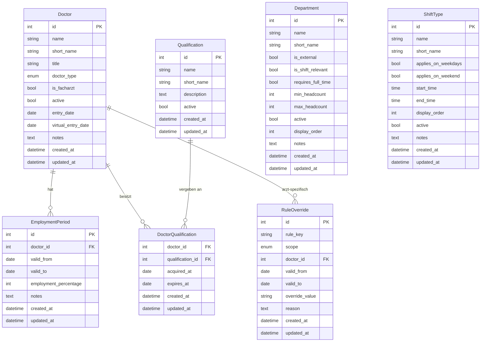
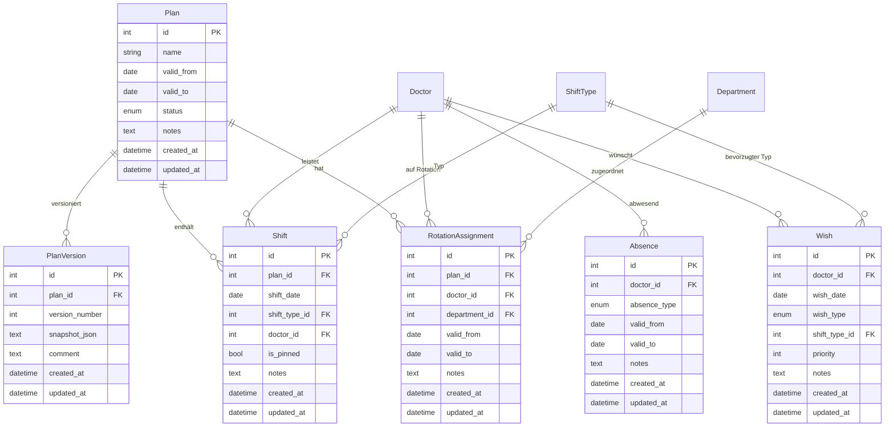

# Datenmodell – Stammdaten

Dieser Artikel beschreibt die Stammdaten-Entitäten des Dienstplaners,
implementiert in Meilenstein M1. Plan-Entitäten (Plan, Schicht, Zuweisung,
Abwesenheit, Wunsch) werden in M2 ergänzt.

## Entitäten-Übersicht



## Erläuterungen

### Warum `EmploymentPeriod` zeitabhängig ist

Der Beschäftigungsumfang eines Arztes (Vollzeit/Teilzeit-Prozentsatz) kann
sich im Laufe der Zeit ändern – z.B. nach Rückkehr aus Elternzeit oder bei
Wechsel von 50% auf 80%. Das Modell speichert daher nicht einen statischen
Wert am Arzt, sondern Perioden mit `valid_from`/`valid_to`.

`valid_to = NULL` bedeutet "unbefristet gültig" (aktueller Zeitraum).
Es ist Aufgabe des Service-Layers, den zum Planungsmonat passenden Zeitraum
zu ermitteln.

### Was `DoctorType.EXTERNAL` bedeutet

Externe Ärzte (z.B. Leihärzte, Honorarärzte) haben ein vereinfachtes Modell:
- Sie haben typischerweise **keine** `EmploymentPeriods` (das Modell erlaubt
  eine leere Liste).
- Planungs-Constraints aus dem Tarifvertrag TV-Ärzte/TdL gelten für sie
  nicht oder nur eingeschränkt.
- Sie können dennoch Dienste übernehmen und werden im Dienstplan aufgeführt.

### `entry_date` und `virtual_entry_date` am Arzt

`entry_date` ist das reale Eintrittsdatum des Arztes in die Klinik.

`virtual_entry_date` ist das für die Rotationspriorisierung maßgebliche
virtuelle Eintrittsdatum. Es ergibt sich aus dem realen Eintrittsdatum plus
Anrechnungszeiten (z.B. aus Voranstellungen). Da das virtuelle Datum auf
Anrechnungen basiert, kann es **vor** dem realen Eintrittsdatum liegen.

Beide Felder sind nullable. Für externe Ärzte werden sie typischerweise nicht
gepflegt. In der ersten Version werden beide Felder manuell gesetzt.
Eine automatische Berechnung aus konfigurierten Anrechnungszeiten folgt später.

### `title` am Arzt (Migration 0007)

`title` ist ein optionales VARCHAR(50)-Feld für den akademischen Titel
(z. B. „Dr. med.", „Prof. Dr. med."). Es ist nullable. Rein display-seitig —
kein Einfluss auf Planungslogik oder Constraints.

### `weiterbildungsjahr` als computed property

`weiterbildungsjahr` wird **nicht** in der Datenbank gespeichert, sondern bei
jedem API-Aufruf berechnet. Berechnungsregel:

- Wenn `is_facharzt = True`: `weiterbildungsjahr = null`
- Wenn `entry_date = null`: `weiterbildungsjahr = null`
- Wenn `entry_date` in der Zukunft liegt: `weiterbildungsjahr = null`
- Sonst: `weiterbildungsjahr = floor((heute - entry_date).days / 365.25) + 1`

Beispiele (heute = 2026-05-07):
- `entry_date=2024-05-01` → ~2 Jahre → WBJ 3
- `entry_date=2026-05-07` → 0 Jahre → WBJ 1
- `entry_date=2025-12-31` → ~0.35 Jahre → WBJ 1

Das Feld erscheint in der OpenAPI-Spezifikation (via Pydantic `@computed_field`),
ist im Frontend read-only und wird nicht als Formularfeld angeboten.

### Warum `is_external` und `is_shift_relevant` getrennt sind

Ein `Department` kann eine externe Rotation sein (`is_external=True`), also
eine Stelle außerhalb der eigenen Klinik (z.B. Psychiatrie, Intensiv Innere).
Diese Bereiche brauchen keine eigene Dienstplanung (`is_shift_relevant=False`).

Die Felder sind dennoch unabhängig, weil theoretisch auch ein externer Bereich
geplante Dienste haben könnte. Beide Felder werden separat konfiguriert.

### `requires_full_time` an Bereichen

Manche Rotationen können ausschließlich von Vollzeit-Mitarbeitern (100%)
besetzt werden. Das Feld `requires_full_time` kennzeichnet diese Bereiche.

Aktuell betrifft das die Curschmann Klinik (CK). Weitere Bereiche können
im Laufe der Zeit hinzukommen.

Die Durchsetzung (keine Teilzeit-Zuweisung auf Vollzeit-Rotation) erfolgt
in Meilenstein M5 als Constraint im Solver. Das Feld ist reine Metadaten für
den Planungskontext.

### `min_headcount` und `max_headcount` an Bereichen (Sollbesetzung)

Die Felder `min_headcount` und `max_headcount` definieren die Sollbesetzung
eines Bereichs. Beide sind nullable:

- `min_headcount = null`: keine Mindestbesetzung definiert
- `max_headcount = null`: keine Obergrenze (unbegrenzt)
- `max_headcount = 0`: Bereich darf nicht besetzt sein (geschlossen)
- Alle Werte im Bereich `[min, max]` sind akzeptabel

Validierungsregeln: beide Felder >= 0; wenn beide gesetzt, dann min <= max.

Die Seeds setzen Initialwerte aus der Excel-Auswertung. Manuell gepflegte
Werte werden durch erneutes Seeden **nicht** überschrieben (Idempotenz).

Die Durchsetzung (Plan unterschreitet Mindestbesetzung) folgt in M5/M8.

### Wie `RuleOverride` funktioniert (Ebenen A und B)

Override-Ebene A (global): `scope=GLOBAL`, `doctor_id=NULL`.
Gilt für alle Ärzte in einem Zeitraum. Beispiel: im August sind grundsätzlich
mehr Bereitschaftsdienste erlaubt.

Override-Ebene B (arzt-spezifisch): `scope=DOCTOR`, `doctor_id=<id>`.
Gilt nur für einen bestimmten Arzt. Beispiel: Dr. Müller darf in Q1 2024
maximal 4 Nachtdienste leisten statt der üblichen 6.

`valid_from`/`valid_to` begrenzen den Gültigkeitszeitraum eines Overrides.
`NULL` bedeutet "unbegrenzt" in die jeweilige Richtung.

`override_value` ist eine String-Repräsentation des neuen Wertes. Der
Service-Layer interpretiert den Typ anhand von `rule_key`.

Override-Ebene C (Einzel-Verstoß-Akzeptanz) ist plan-bezogen und wird
in Meilenstein M2/M5 ergänzt.

## Initiale Bereiche (23 Stück)

| Nr | Name | Kürzel | Extern | Dienst-relevant | Vollzeit | Min | Max |
|----|------|--------|--------|-----------------|----------|-----|-----|
| 1 | 511/LBEST | LBEST | Nein | Ja | Nein | 1 | 1 |
| 2 | 511 | 511 | Nein | Ja | Nein | 2 | 3 |
| 3 | ITS | ITS | Nein | Ja | Nein | 2 | 3 |
| 4 | SU-Stationsarzt | SU-SA | Nein | Ja | Nein | 1 | 1 |
| 5 | SU | SU | Nein | Ja | Nein | 6 | 8 |
| 6 | Duplex | Du | Nein | Ja | Nein | 1 | 1 |
| 7 | Poli | Poli | Nein | Ja | Nein | 1 | 1 |
| 8 | Poli/EMG | Poli/EMG | Nein | Ja | Nein | 1 | 1 |
| 9 | EMG | EMG | Nein | Ja | Nein | 1 | 1 |
| 10 | Springer | Spr | Nein | Ja | Nein | 2 | 2 |
| 11 | Parkinson Komplextherapie | ParkiKomp | Nein | Ja | Nein | 1 | 1 |
| 12 | Tagesklinik | TK | Nein | Ja | Nein | 1 | 1 |
| 13 | Neuromotorik-TK | NM-TK | Nein | Ja | Nein | 1 | 1 |
| 14 | Poli/Botox/THS | – | Nein | Ja | Nein | 1 | 1 |
| 15 | Poli/Botox | – | Nein | Ja | Nein | 1 | 1 |
| 16 | MS-Sprechstunde/Konsile | MS | Nein | Ja | Nein | 1 | 1 |
| 17 | Forschung | Fo | Nein | Ja | Nein | 4 | 5 |
| 18 | Curschmann Klinik | CK | Nein | Ja | **Ja** | – | – |
| 19 | Intensiv Innere | – | Ja | Nein | Nein | 1 | 1 |
| 20 | Psychiatrie | – | Ja | Nein | Nein | 2 | 4 |
| 21 | ZIP | – | Ja | Nein | Nein | 0 | 1 |
| 22 | Intensiv (NCH) | – | Ja | Nein | Nein | 1 | 1 |
| 23 | Intensiv extern | – | Ja | Nein | Nein | 1 | 1 |

## Initiale Schichttypen

| Name | Kürzel | Werktag | Wochenende | Start | Ende |
|------|--------|---------|------------|-------|------|
| V-Dienst | V | Ja | Nein | 15:00 | 20:15 |
| Tagdienst | T | Nein | Ja | 07:30 | 19:30 |
| Nachtdienst | N | Ja | Ja | 19:30 | 07:30 |
| Tagdienst INA | T1 | Ja | Nein | 07:30 | 16:00 |

Nachtdienst hat `start_time > end_time` (19:30 > 07:30), was Mitternachts-
überschreitung bedeutet. Das Schema erlaubt dies explizit.
T1 (Interdisziplinäre Notaufnahme) ist ein bereichsspezifischer Tagdienst,
der global modelliert ist. Die Eingrenzung auf die INA als Bereich folgt
in M8 als Solver-Constraint.

## App-Einstellungen (app_settings)

Key-Value-Tabelle für klinikweite Konfiguration. Settings werden über
Alembic-Migrationen initial angelegt; die API erlaubt nur Update.

```
AppSetting:
  id          int (PK)
  key         str (unique, max 100)   – stabiler Bezeichner
  value       str (max 1000)          – aktueller Wert als String
  description str | None (max 500)    – Beschreibung für die UI
  updated_at  datetime                – letzter Schreibzeitpunkt
```

Initiale Einstellungen (in Migration 0006 angelegt):

| Key | Default-Wert | Beschreibung |
|-----|-------------|-------------|
| `clinic_name` | `Neurologie UKSH Lübeck` | Name der Klinik (wird im Header angezeigt) |

Hinweis: Setting-Werte sind immer Strings. Für Zahlen oder Booleans muss
der Client parsen (z.B. `parseInt(value)` oder `value === "true"`). Typisierung
folgt bei Bedarf.

Kein Create/Delete über die API – neue Settings kommen per Migration hinzu.

## Plan-Entitäten (ab M2)

### Übersicht: Plan-Modell



### Hybrid-Modell: Schicht ohne Bereich

Eine `Shift` speichert **nicht** den Bereich (Department) direkt. Der Bereich
ergibt sich zur Laufzeit aus den aktiven `RotationAssignments` des Arztes
zum Zeitpunkt der Schicht. Dieses Hybrid-Modell hat zwei Vorteile:

1. Schichten müssen nicht bei Rotationsänderungen migriert werden.
2. Unbesetzte Schichten (`doctor_id=NULL`) haben naturgemäß keinen Bereich.

Die Bereichszuordnung wird im Service-Layer und später im Solver berechnet.

Eine Schicht-Zuweisung (doctor_id, is_pinned, notes) kann manuell per
`PATCH /api/shifts/{id}` geändert werden (implementiert in M2-004).
Semantische Validierung (INA-Verfügbarkeit, Qualifikation, Doppelbuchung)
erfolgt **nicht** im Schreib-Pfad – diese Konflikte werden read-only durch
die Konflikt-Engine (M2-005) zurückgegeben und im Frontend markiert.

### Plan-Status und Editierbarkeit

`PlanStatus` kennt drei Zustände: `DRAFT`, `RELEASED`, `ARCHIVED`.
Der Plan bleibt auch nach `RELEASED` editierbar – für Krankheitsausfälle
und kurzfristige Änderungen. `ARCHIVED` signalisiert abgelaufene Zeiträume
und wird nur im UI als Schutz genutzt, nicht als DB-Constraint.

### Plan-Versionierung als JSON-Snapshot

`PlanVersion` speichert den vollständigen Planstand als JSON-Text in SQLite.
Format:
```json
{
  "plan": {...},
  "shifts": [...],
  "rotation_assignments": [...]
}
```
Jede Version ist durch `(plan_id, version_number)` eindeutig (1-basiert).
Snapshot-Erstellung und -Restore-Logik folgen in M2-002.

### Pin-Konzept (Variante C)

`Shift.is_pinned = True` markiert manuell gesetzte Zuweisungen. Der Solver
(ab M5/M8) respektiert gepinnte Schichten und überschreibt sie nicht.
Pin ist pro Schicht einzeln löschbar.

### Geteilte Rotationen

Mehrere `RotationAssignment`-Einträge für denselben Plan, Arzt und Bereich
mit überlappenden Zeiträumen sind explizit erlaubt (kein UNIQUE-Constraint).
Das Modell zeigt "Doctor A und Doctor B sind beide auf SU vom 1. bis 30."
Die fachliche Interpretation (Aufteilung, Vollzeit-Äquivalente) obliegt
dem Solver in M8.

### Abwesenheiten (plan-unabhängig)

`Absence` ist nicht an einen Plan gebunden. Urlaub oder Krankheit gilt
für alle Pläne, die den Zeitraum berühren. Der Service-Layer verknüpft
Abwesenheiten zur Planungszeit mit dem relevanten Plan.

`AbsenceType` kennt: URLAUB, KRANKHEIT, FORTBILDUNG, ELTERNZEIT,
MUTTERSCHUTZ, SONSTIGES.

### Wünsche (date-basiert)

`Wish` ist doctor-bezogen und referenziert einen konkreten Tag (`wish_date`).

| WishType | shift_type_id |
|----------|--------------|
| AVOID_DAY | muss NULL sein |
| AVOID_SHIFT | muss gesetzt sein |
| REQUIRE_SHIFT | muss gesetzt sein |

Diese Cross-Field-Regel wird im Pydantic-Schema (`model_validator`) und
im Service-Layer geprüft. Recurring-Wünsche und Cross-Day-Constraints
folgen in einem späteren Schema-Update.

`priority`: 1 = hoch, 2 = mittel, 3 = niedrig.

## INA-Verfügbarkeitsmodell (ab M2)

### Überblick

Drei Quellen können einen Arzt an einem Datum für INA-Dienste (V/T/N-Schichten)
ausschließen:

1. **Aktive Rotation in einem blockierenden Bereich** – `Department.blocks_ina_weekdays`
   und `Department.blocks_ina_weekends` steuern, ob eine Rotation den Arzt
   werktags oder am Wochenende ausschließt.

2. **Manueller INA-Ausschluss (INAExclusion)** – arzt- und zeitraumbezogen,
   mit Grund (Schwangerschaft, Einarbeitung, Sonstiges) und optionalen Notizen.

3. **Aktive Abwesenheit** – Urlaub, Krankheit usw. blockieren pauschal.

Die Service-Funktion `get_ina_availability(db, doctor_id, target_date)` liefert
`INAAvailability(available, reasons)` mit deutschen Reason-Strings für die UI.
Die Konflikt-Engine (M2-005) nutzt diese Funktion als Read-Consumer, um
`NOT_AVAILABLE`-Konflikte in `GET /api/plans/{plan_id}/conflicts` zu erkennen.

### CK-Sonderfall

Die Curschmann Klinik (CK) blockiert Ärzte nur **werktags** (`blocks_ina_weekdays=True`,
`blocks_ina_weekends=False`). Am Wochenende stehen CK-Ärzte für INA-Tagdienste und
Nachtdienste zur Verfügung.

### Einarbeitung als Rotation

`RotationAssignment.is_einarbeitung=True` blockiert den Arzt unabhängig vom
`blocks_ina_*`-Wert des Departments. So kann z.B. eine EMG-Einarbeitung den Arzt
ausschließen, obwohl EMG selbst keine INA-Blockierung hat.

### INAExclusion

```
INAExclusionReason: SCHWANGERSCHAFT | EINARBEITUNG | SONSTIGES
INAExclusion:
  doctor_id FK doctors.id (CASCADE)
  valid_from Date (not null)
  valid_to   Date (nullable = unbefristet)
  reason     INAExclusionReason
  notes      Text (nullable)
```

Constraints: `valid_to IS NULL OR valid_from <= valid_to`

### Department-Erweiterungen

Zwei neue Boolean-Felder (Default `False`):
- `blocks_ina_weekdays` – Rotation blockiert INA-Verfügbarkeit Mo–Fr
- `blocks_ina_weekends` – Rotation blockiert INA-Verfügbarkeit Sa/So

### Cascade-Verhalten

| Eltern-Entität gelöscht | Kaskadiert auf |
|------------------------|----------------|
| Plan | Shifts, RotationAssignments, PlanVersions |
| Doctor | Absences, Wishes, RotationAssignments, (Shifts: SET NULL) |
| Department | RotationAssignments |
| ShiftType | (Shifts: RESTRICT), (Wishes: SET NULL) |

Doctors und Departments werden beim Plan-Löschen **nicht** kaskadiert gelöscht.
